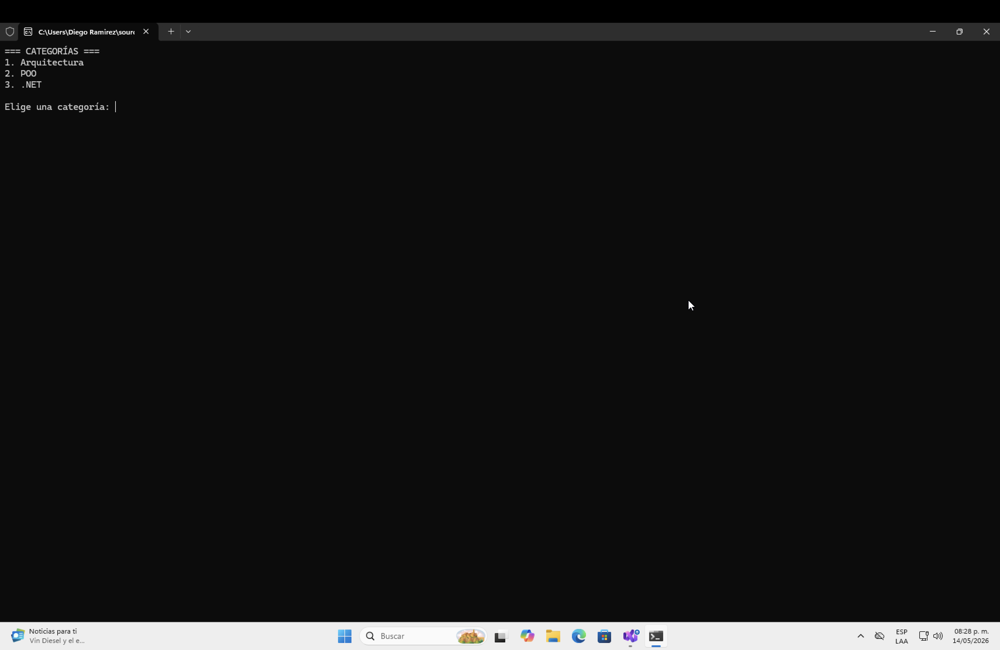
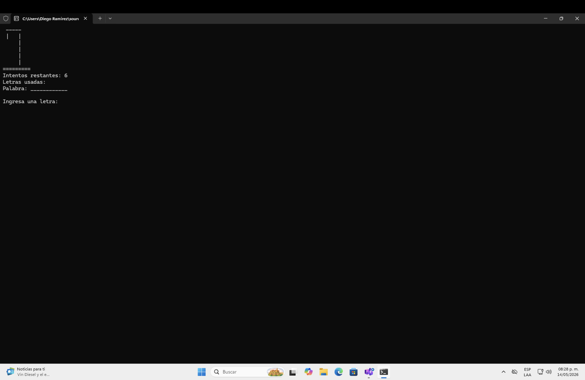
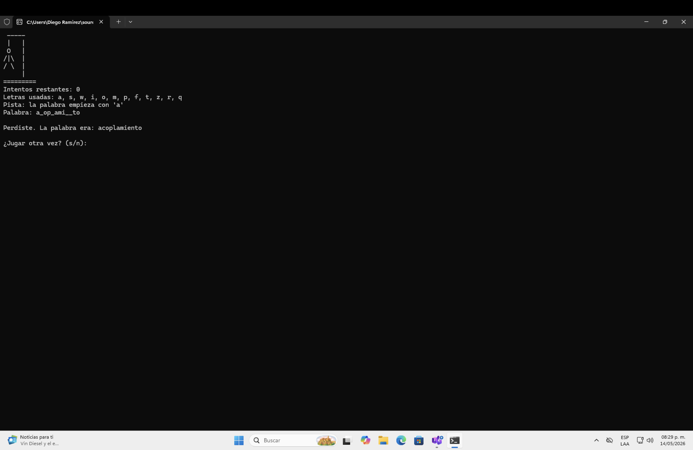

# Ahorcado

Proyecto de consola desarrollado en C# como práctica de programación orientada a objetos
y principios SOLID.

El juego permite al usuario seleccionar una categoría de palabras y jugar Ahorcado desde
la consola.

## Funcionalidades

- Menú de categorías.
- Selección aleatoria de palabras.
- Registro de letras usadas.
- Conteo de intentos restantes.
- Dibujo del ahorcado en consola.
- Pistas cuando quedan pocos intentos.
- Opción para volver a jugar.

## Requisitos

- .NET SDK
- Visual Studio o Visual Studio Code
- Consola de Windows, PowerShell o terminal compatible

## Cómo ejecutar

Desde la carpeta del proyecto:

```bash
dotnet run
```

Para comprobar que compila correctamente:

```bash
dotnet build
```

## Estructura del proyecto

| Archivo | Responsabilidad |
|---|---|
| Program.cs | Controla el flujo principal del juego. |
| MotorAhorcado.cs | Contiene la lógica del Ahorcado. |
| ConsolaUI.cs | Muestra mensajes, dibuja el tablero y lee entradas del usuario. |
| IRepositorioPalabras.cs | Define la abstracción para obtener palabras. |
| PalabrasEnMemoria.cs | Contiene las palabras organizadas por categoría. |
| Juego.cs | Versión inicial del juego, conservada como referencia. |

## Principios SOLID aplicados

### Single Responsibility Principle

La lógica del juego se separó de la interfaz de usuario.

MotorAhorcado se encarga únicamente de las reglas del juego, mientras que ConsolaUI se
encarga de interactuar con la consola.

### Dependency Inversion Principle

MotorAhorcado depende de la interfaz IRepositorioPalabras, no de una clase concreta.

Esto permite cambiar la fuente de palabras sin modificar la lógica principal del juego.

### Open/Closed Principle

El proyecto puede extenderse agregando nuevas fuentes de palabras o nuevas interfaces sin
modificar directamente el motor del juego.

## Capturas de pantalla

| Menú de categorías | Juego iniciado |
|---|---|
|  |  |

| Partida perdida |
|---|
|  |

## Estado del proyecto

El proyecto compila correctamente con:

```bash
dotnet build
```

## Cláusula de IA

Este proyecto fue realizado con apoyo de las diapositivas del maestro.

Se utilizó IA como apoyo para revisar errores, mejorar la redacción del README y orientar
la refactorización del código.
