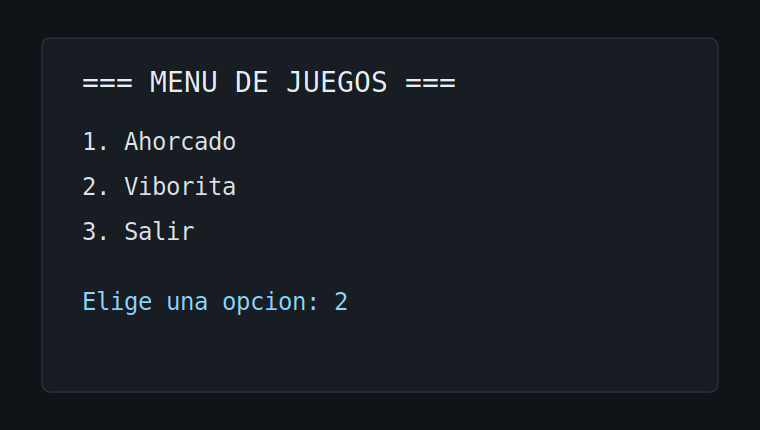
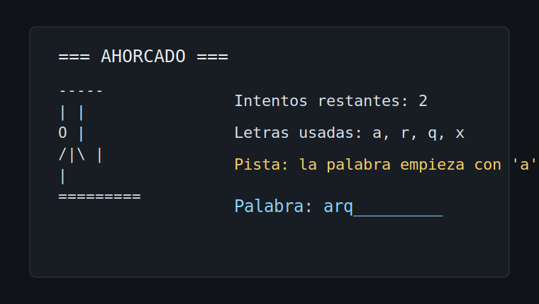
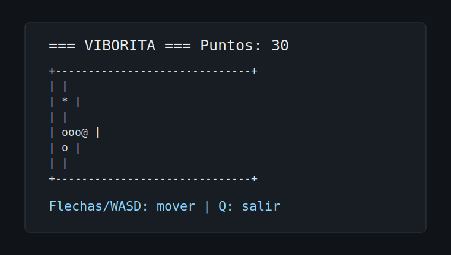

# Ahorcado y Viborita

Proyecto de consola en C# con un menu principal para elegir entre dos juegos:

- Ahorcado
- Viborita

El objetivo del proyecto es separar la logica del juego de la interfaz de consola y aplicar principios SOLID mediante clases e interfaces pequeñas.

## Requisitos

- .NET 10 SDK
- Windows Terminal, PowerShell o la consola integrada de Visual Studio

## Como ejecutar

Desde la carpeta del proyecto:

```bash
dotnet run
```

Para comprobar que el proyecto compila:

```bash
dotnet build
```

## Menu principal

Al iniciar la aplicacion se muestra un menu para elegir el juego:

1. Ahorcado
2. Viborita
3. Salir



## Ahorcado

El juego de Ahorcado permite seleccionar una categoria de palabras y adivinar la palabra secreta letra por letra.

Categorias disponibles:

- Arquitectura
- POO
- .NET

Cuando quedan pocos intentos, el juego muestra una pista con la primera letra de la palabra.



## Viborita

El juego de Viborita usa un tablero en consola. La cabeza se muestra con `@`, el cuerpo con `o` y la comida con `*`.

Controles:

- Flechas: mover la viborita
- WASD: mover la viborita
- Q: salir de la partida

Cada comida suma puntos y hace crecer la viborita. El juego termina si choca contra la pared o contra su propio cuerpo.



## Estructura del proyecto

| Archivo | Responsabilidad |
|---|---|
| `Program.cs` | Muestra el menu principal y controla el flujo de cada juego. |
| `MotorAhorcado.cs` | Contiene la logica del Ahorcado. |
| `ConsolaUI.cs` | Dibuja y lee entradas del Ahorcado en consola. |
| `MotorViborita.cs` | Contiene la logica de movimiento, comida, puntos y colisiones de Viborita. |
| `ConsolaUIViborita.cs` | Dibuja el tablero de Viborita y lee controles. |
| `IRepositorioPalabras.cs` | Abstrae la fuente de palabras. |
| `PalabrasEnMemoria.cs` | Provee palabras por categoria. |
| `IMotorJuego.cs` | Define operaciones comunes para motores de juego. |
| `IMotorViborita.cs` | Define el contrato especifico del motor de Viborita. |

## Principios SOLID aplicados

### Single Responsibility Principle

La logica de cada juego esta separada de la interfaz de consola. Los motores (`MotorAhorcado` y `MotorViborita`) no dependen de `Console`.

### Dependency Inversion Principle

`MotorAhorcado` depende de `IRepositorioPalabras`, no de una clase concreta. Esto permite cambiar la fuente de palabras sin modificar el motor.

### Open/Closed Principle

El proyecto puede crecer agregando nuevos motores y nuevas interfaces de usuario sin modificar directamente la logica existente de los juegos actuales.

## Estado actual

El proyecto compila correctamente con:

```bash
dotnet build
```

Resultado esperado:

```text
Compilacion correcta.
0 advertencias
0 errores
```

## Clausula de IA

El proyecto fue desarrollado con apoyo de las diapositivas del maestro y asistencia de IA para revisar errores, refactorizar codigo, mejorar la organizacion del proyecto y redactar este README.
